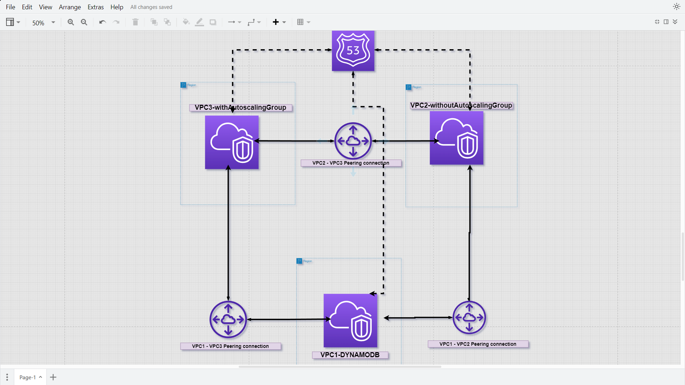
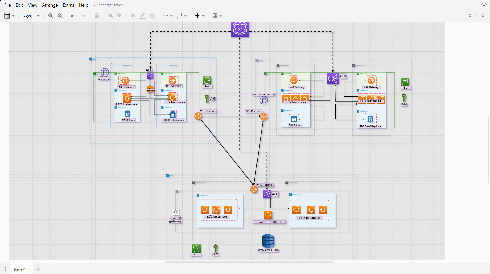
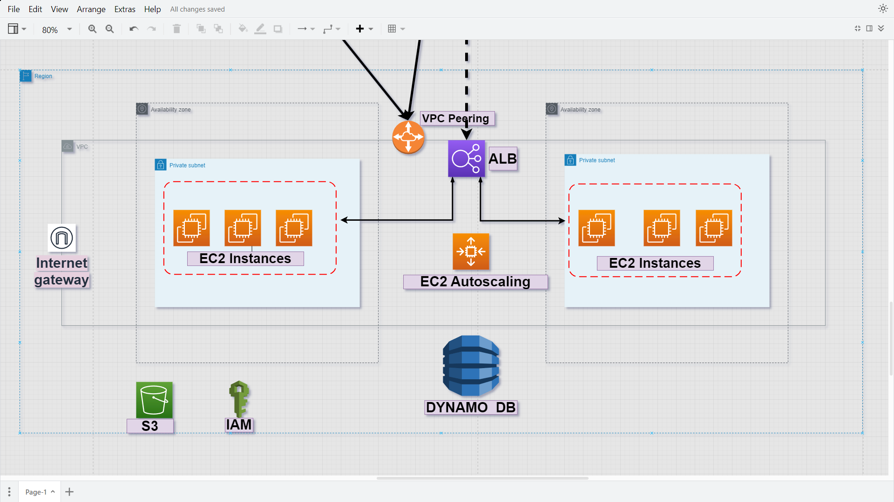
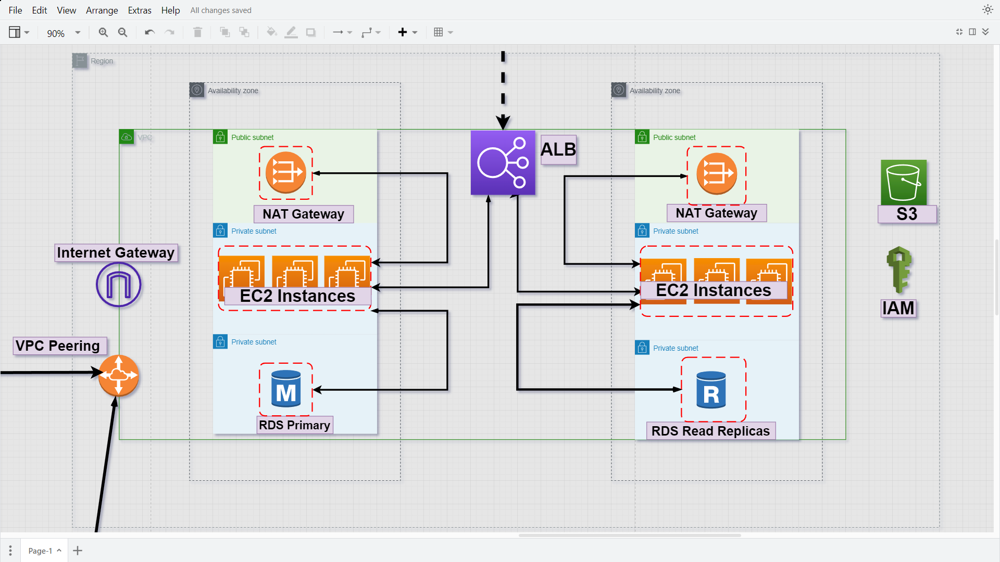
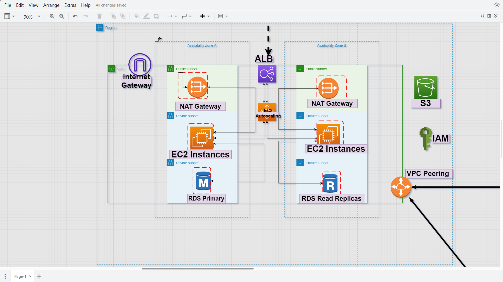

This is a three VPC architecture connected through VPC peering. Each VPC contains a 3-tier architecture with a presentation layer, application layer and a database layer. This project is built from scratch though the architecting of the VPCs and all other components used in this project. Installed in each of the web applications are different applications to collect data and store them in the databases. Also, the VPCs can share data between each other. Each application can be accessible independently through the internet via a domain name registered on route53.

Basic architectural layer out 



Main network architecture



VPC1-DYNAMODB



VPC2-without-AutoscalingGroup




VPC3-withAutoscalingGroup



This project will be built in parts then merged together at the end. The first design is the VPC1 followed by VPC2 and VPC3.


## Step 1

#### VPC1-DYNAMODB 


```bash

# There is an error in this code as it doesn't run successfully on the Amazon linux User data page.

#!/bin/bash -ex
wget https://vpc1-dynamodb-application.s3.amazonaws.com/FlaskApp.zip
unzip FlaskApp.zip
cd FlaskApp/
yum -y install python3 mysql
pip3 install -r requirements.txt
amazon-linux-extras install epel
yum -y install stress
export PHOTOS_BUCKET=${SUB_PHOTOS_BUCKET}
export AWS_DEFAULT_REGION=<INSERT REGION HERE>
export DYNAMO_MODE=on
FLASK_APP=application.py /usr/local/bin/flask run --host=0.0.0.0 --port=80
```